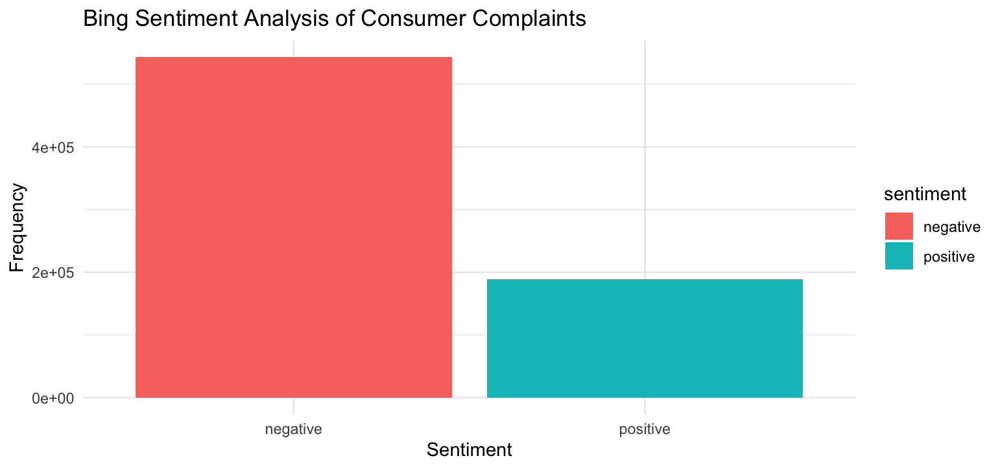
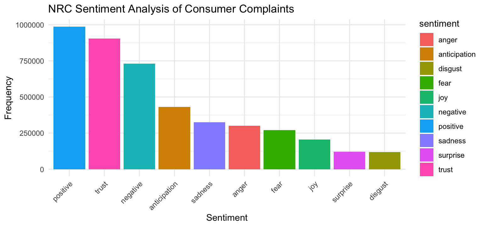
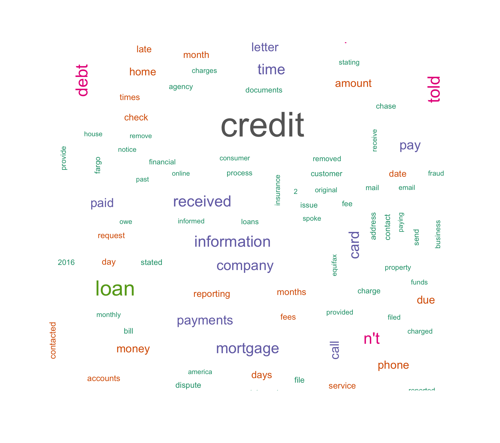

# **Consumer Complaints**

library(ggplot2)
library(dplyr)
library(readxl)
library(tidyr)
library(stringr)
library(readr)
library(wordcloud)
library(tidytext)

rm(list = ls())

setwd('~/Desktop/College/Junior/Spring Semester/DATA-332')

consumer_data <- read_csv('Consumer_Complaints.csv')

head(consumer_data)

consumer_tidy <- consumer_data %>%
  select(complaint_id = `Complaint ID`, consumer_complaint = `Consumer complaint narrative`) %>%
  filter(!is.na(consumer_complaint))

consumer_tokens <- consumer_tidy %>%
  unnest_tokens(word, consumer_complaint)

consumer_tokens_clean <- consumer_tokens %>%
  anti_join(stop_words)

bing_sentiment <- consumer_tokens_clean %>%
  inner_join(get_sentiments("bing")) %>%
  count(sentiment, sort = TRUE)

bing_sentiment %>%
  ggplot(aes(x = sentiment, y = n, fill = sentiment)) +
  geom_bar(stat = "identity") +
  labs(title = "Bing Sentiment Analysis of Consumer Complaints",
       x = "Sentiment",
       y = "Frequency") +
  theme_minimal()

 **This bing sentiment clearly shows negative and positive sentiment frequencies** 

nrc_sentiment <- consumer_tokens_clean %>%
  inner_join(get_sentiments("nrc")) %>%
  count(sentiment, sort = TRUE)

nrc_sentiment %>%
  ggplot(aes(x = reorder(sentiment, -n), y = n, fill = sentiment)) +
  geom_bar(stat = "identity") +
  labs(title = "NRC Sentiment Analysis of Consumer Complaints",
       x = "Sentiment",
       y = "Frequency") +
  theme_minimal() +
  theme(axis.text.x = element_text(angle = 45, hjust = 1))

 **This nrc sentiment shows more nuanced sentiments** 

consumer_tokens_clean <- consumer_tokens_clean %>%
  filter(!str_detect(word, "(?i)X{2,}"))

consumer_tokens_clean %>%
  count(word, sort = TRUE) %>%
  with(wordcloud(word, n, max.words = 100, colors = brewer.pal(8, "Dark2")))

 **Wordcloud visually represents frequency and importance of complaint words** 

