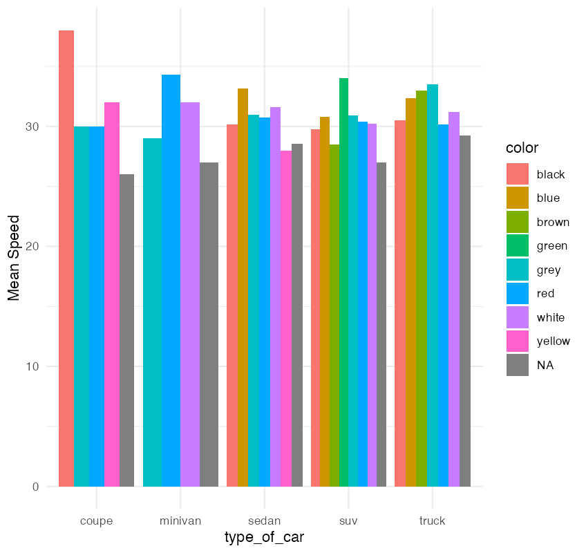
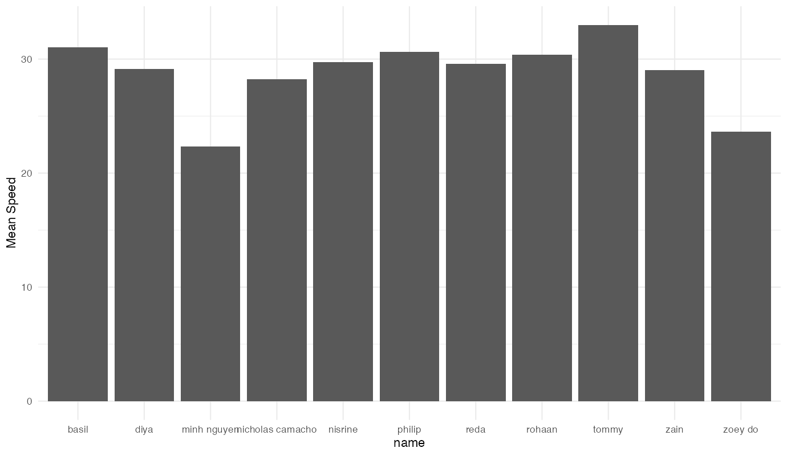

# Radar Speed Analysis Dashboard

This Shiny web application merges and visualizes radar speed data collected by students from multiple GitHub repositories. It allows users to interactively explore how vehicle speed varies with factors like time of day, car type, and collector identity.

## Features

- **Data Merging**: Combines multiple datasets (CSV/XLSX) from GitHub.
- **Data Cleaning**: Standardizes inconsistent column names, parses time formats, and categorizes vehicle types.
- **Interactive Visualization**: Displays bar charts of average speed grouped by customizable X-axis and color grouping.
- **Live Table Output**: View the underlying data driving the plots.

## Technologies Used

- **R**
- **Shiny** (UI and interactivity)
- **ggplot2** (visualization)
- **dplyr** and **janitor** (data cleaning)
- **lubridate** (time parsing)
- **readr**, **readxl**, **httr** (data importing)
- **DT** (interactive data tables)

## Data Sources

This project loads radar speed tracking datasets from seven different GitHub repositories, with files in `.csv` and `.xlsx` formats. Each dataset may have slight differences in naming conventions and structure, which the app automatically resolves.

## Data Cleaning Details

- Merges similar columns like:
  - `speed`, `mph`, `final_speed` → `speed`
  - `time`, `hour`, `hr_min` → `time`
  - `recorder`, `student`, `name` → `name`
  - `type_of_car`, `vehicle_style`, `body_style` → `type_of_car`
- Cleans and normalizes:
  - Color labels (`light grey`, `dark grey`, etc. → `grey`)
  - Vehicle types (`1`, `van` → `minivan`, etc.)
- Parses and standardizes time to `HH:MM` format.

## Example Use Cases

- Analyze speeding patterns throughout the day.
- Compare speeds across student collectors.
- Identify which vehicle types tend to drive faster.

## This bar chart shows Speed vs type_of_car split by color

You can tell that black coupes are the fastest cars, whereas grey minivans are the slowest.

## This bar chart shows Speed vs name split by speed
Here you can see that Tommy had the highest mean speed of all the people recording and minh had the lowest

## This bar chart shows the mean speed by weather
Here you can see that cars drove the fastest when it was cloudy and the fastest when it was sunny.

## Questions answered#

To make my Shiny App functional I had to make several adjustments. First, I standardized inconsistent column names across datasets. For example, speed, final_speed, mph all became speed, similarly, recorder, student, and observer became name. This ensured a unified structure when merging datasets. I also removed redundant or columns that only few groups had to streamline the visualization process and avoid plotting misleading or empty values. A key update was changing the charting to bar charts only, using stat_summary() to plot average speeds by category. Additionally, I called all the data from my personal GitHub repository using the blob_to_raw() function, allowing me to pull raw CSV and Excel files directly into the app—saving both space and time in file management.

Wrangling the data posed several challenges. Many datasets had inconsistent formatting, with time recorded in various ways (12:30 PM, 14:00, 1330, etc.), which I resolved using lubridate::parse_date_time() and reformatting them to HH:MM. Some datasets were missing key fields, while others had extra columns with unclear or nonstandard names. Cleaning these inconsistencies and extracting only the useful information taught me the importance of clean and consistent data collection practices. This assignment gave me a practical understanding of how messy real-world data can be and emphasized the need for rigorous preprocessing before any meaningful analysis or visualization. I also learned how to automate cleaning steps using dplyr and janitor, making the pipeline scalable for future projects.

## Shiny App

https://philipexldataclass.shinyapps.io/countCars/
